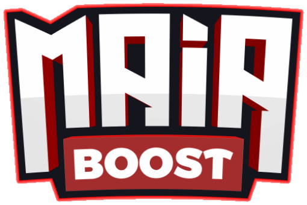
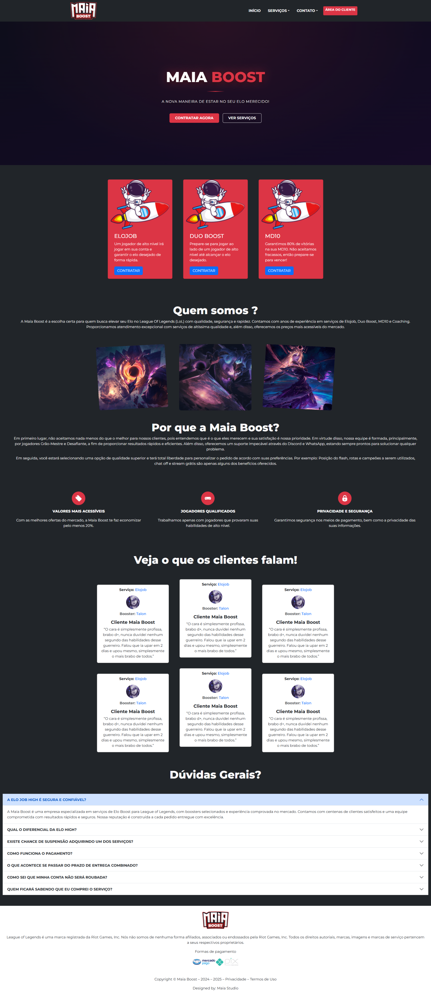
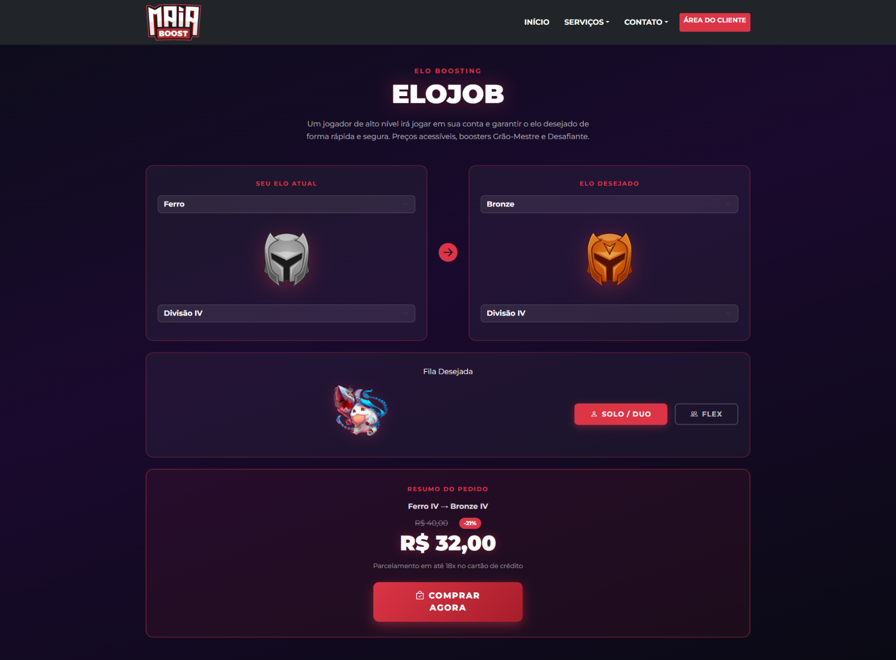

<div align="center">
  

  <h1>⚔️ Maia Boost</h1>
  <p><strong>Site de Elo Boost para League of Legends</strong></p>

  
  
  
  
  
</div>

---

> 🗃️ **Projeto arquivado.** Este repositório está preservado como registro da minha evolução como desenvolvedor. O projeto foi descontinuado e não receberá atualizações.

---

## 📸 Preview

| Página Inicial | Elojob |
|---|---|
|  |  |

---

## 🚀 Sobre o Projeto

**Maia Boost** foi um site de serviços de **Elo Boost para League of Legends**, desenvolvido com foco em conversão, visual impactante e experiência de compra fluida.

O site contava com landing page completa, depoimentos de clientes, FAQ e uma página de configuração de pedido interativa — onde o usuário selecionava o elo atual, elo desejado, tipo de fila e visualizava o preço em tempo real.

---

## ✨ O que foi implementado

- 🎮 **Landing Page** com hero section, cards de serviços, depoimentos e FAQ
- ⚔️ **Página de Elojob** interativa com:
  - Seleção de elo atual e elo desejado (Ferro → Desafiante)
  - Imagens dos ranks atualizadas dinamicamente ao selecionar
  - Seleção de fila (Solo/Duo ou Flex)
  - Cálculo de preço em tempo real
  - Exibição de desconto e botão de compra
- 📱 **Design responsivo** com Bootstrap 5
- 🌑 **Tema dark** com gradientes e destaque em vermelho

---

## 🛠️ Tecnologias

| Tecnologia | Uso |
|---|---|
| HTML5 | Estrutura das páginas |
| CSS3 | Estilização customizada com gradientes |
| Bootstrap 5 | Grid, componentes e responsividade |
| Bootstrap Icons | Ícones de interface |
| JavaScript (Vanilla) | Troca de imagem de rank e cálculo de preço |
| Google Fonts (Montserrat) | Tipografia |

---

## 📁 Estrutura do Projeto

```
maiaboost/
├── index.html             # Página principal (landing page)
├── elojob.html            # Página de pedido de Elojob
├── README.md
└── assets/
    ├── css/
    │   ├── index.css
    │   └── elojob.css
    ├── js/
    │   └── trocaimg.js
    └── imgs/
        ├── logo.png
        ├── rank-1.png → rank-9.png
        └── ...
```

---

## 🎮 Serviços que seriam oferecidos

| Serviço | Descrição |
|---|---|
| **Elojob** | Um jogador de alto nível joga na sua conta até o elo desejado |
| **Duo Boost** | Você joga junto com um booster Mestre/Desafiante |
| **MD10** | 80% de vitórias garantidas nas 10 partidas de posicionamento |
| **Vitórias** | Pacotes de vitórias individuais |
| **Maestria** | Acúmulo de pontos de maestria em campeões |
| **Coach** | Sessões de coaching com jogadores de alto nível |
| **Manutenção de Elo** | Manutenção do elo atual sem queda de divisão |
| **Clash** | Elojob e Duo Boost para torneios Clash |

### Extras planejados para o pedido

| Extra | Descrição |
|---|---|
| Taxa MMR | Boost com ajuste de MMR |
| Fila Smurf / MMR Bufado | Serviço em conta smurf ou com MMR elevado |
| Chat Offline | Booster joga com o chat desativado |
| Posição de Feitiços | Escolha da posição do Flash e demais feitiços |
| Rotas Específicas | Booster joga apenas nas rotas escolhidas |
| Serviço Prioritário | Atendimento com prioridade máxima na fila |
| Vitória Extra | Adição de vitórias extras ao pedido |
| Booster Favorito | Escolha de um booster específico da equipe |
| Campeões Específicos | Booster joga apenas com os campeões selecionados |
| Maestria | Aumento de pontos de maestria nos campeões escolhidos |
| Horários Restritos | Jogo apenas nos horários definidos pelo cliente |
| Stream Online | Acompanhamento do serviço em tempo real via stream |
| Redução de KDA | Booster joga de forma discreta |
| Redução de Prazo | Entrega acelerada do pedido |
| Serviço Solo | Serviço garantido em fila solo |

---

## 📄 Aviso Legal

> League of Legends é uma marca registrada da Riot Games, Inc. A Maia Boost não é afiliada, associada ou endossada pela Riot Games, Inc. Todos os direitos autorais, marcas e imagens pertencem a seus respectivos proprietários.

---

<div align="center">
  <p>Feito com ❤️ por <strong>Allan Maia</strong></p>
</div>
